# GCSE Pal Database Structure Diagram

```mermaid
erDiagram
    %% Core User Management
    users ||--|| user_settings : has
    users ||--o{ enrollments : enrolls
    users ||--o{ progress : tracks
    users ||--o{ quiz_attempts : attempts
    users ||--o{ notes : creates
    users ||--o{ tasks : owns
    users ||--o{ study_sessions : has
    users ||--o{ bookmarks : creates
    users ||--o{ user_favorites : favors
    users ||--o{ study_group_members : joins
    users ||--o{ study_group_messages : sends
    users ||--o{ flash_card_reviews : reviews
    users ||--o{ evaluation_stats : has

    %% Course Structure (Hierarchical)
    courses ||--o{ chapters : contains
    chapters ||--o{ lessons : contains
    courses ||--o{ enrollments : enrolled_in
    courses ||--o{ progress : tracked_in
    courses ||--o{ quizzes : contains
    courses ||--o{ notes : taken_for
    courses ||--o{ tasks : related_to
    courses ||--o{ study_sessions : for
    courses ||--o{ bookmarks : in
    courses ||--o{ user_favorites : favorited
    courses ||--o{ study_groups : about
    courses ||--o{ flash_cards : contains
    courses ||--o{ evaluation_stats : measured_for
    courses ||--o{ course_tags : tagged_with

    %% Chapter and Lesson Relationships
    chapters ||--o{ lessons : contains
    chapters ||--o{ progress : tracked_in
    chapters ||--o{ quizzes : contains
    chapters ||--o{ notes : taken_for
    chapters ||--o{ tasks : related_to
    chapters ||--o{ bookmarks : in
    chapters ||--o{ flash_cards : contains
    chapters ||--o{ evaluation_stats : measured_for

    lessons ||--o{ progress : tracked_in
    lessons ||--o{ quizzes : contains
    lessons ||--o{ notes : taken_for
    lessons ||--o{ tasks : related_to
    lessons ||--o{ study_sessions : for
    lessons ||--o{ bookmarks : in
    lessons ||--o{ flash_cards : contains

    %% Quiz System
    quizzes ||--o{ questions : contains
    quizzes ||--o{ quiz_attempts : attempted
    questions ||--o{ quiz_answers : answered

    %% Study System
    study_sessions ||--o{ study_activities : contains
    quiz_attempts ||--o{ quiz_answers : records

    %% Study Groups
    study_groups ||--o{ study_group_members : has
    study_groups ||--o{ study_group_messages : contains
    study_groups ||--o{ study_group_members : created_by

    %% Flash Cards
    flash_cards ||--o{ flash_card_reviews : reviewed

    %% Table Definitions
    users {
        uuid id PK
        text clerk_id UK
        text email UK
        text name
        text avatar
        enum role
        timestamp created_at
        timestamp updated_at
    }

    user_settings {
        uuid id PK
        text user_id FK
        enum theme
        boolean email_notifications
        boolean push_notifications
        boolean study_reminders
        boolean deadline_reminders
        integer daily_goal
        enum preferred_study_time
        jsonb study_days
        timestamp created_at
        timestamp updated_at
    }

    courses {
        uuid id PK
        text title
        text description
        enum subject
        enum level
        text thumbnail
        text instructor
        text instructor_id
        integer duration
        enum difficulty
        array topics
        enum status
        integer enrollment_count
        real rating
        real price
        timestamp created_at
        timestamp updated_at
    }

    chapters {
        uuid id PK
        text course_id FK
        text title
        text description
        integer order
        integer duration
        boolean is_published
        timestamp created_at
        timestamp updated_at
    }

    lessons {
        uuid id PK
        text chapter_id FK
        text title
        text description
        text content
        text video_url
        integer video_duration
        text markdown_path
        boolean has_video
        boolean has_markdown
        integer order
        integer duration
        boolean is_published
        text mux_asset_id
        text mux_upload_id
        text mux_status
        timestamp created_at
        timestamp updated_at
    }

    enrollments {
        uuid id PK
        text user_id FK
        text course_id FK
        timestamp enrolled_at
        timestamp completed_at
        real progress
        enum status
    }

    progress {
        uuid id PK
        text user_id FK
        text course_id FK
        text chapter_id FK
        text lesson_id FK
        enum status
        timestamp started_at
        timestamp completed_at
        integer time_spent
        real score
        timestamp last_accessed
    }

    quizzes {
        uuid id PK
        text lesson_id FK
        text chapter_id FK
        text course_id FK
        text title
        text description
        integer time_limit
        real passing_score
        integer max_attempts
        boolean is_published
        timestamp created_at
        timestamp updated_at
    }

    questions {
        uuid id PK
        text quiz_id FK
        text question
        enum type
        text options
        text correct_answer
        text explanation
        integer points
        integer order
    }

    quiz_attempts {
        uuid id PK
        text user_id FK
        text quiz_id FK
        real score
        boolean passed
        timestamp started_at
        timestamp completed_at
        integer time_spent
        integer attempt_number
    }

    quiz_answers {
        uuid id PK
        text attempt_id FK
        text question_id FK
        text user_answer
        boolean is_correct
        integer points
    }

    notes {
        uuid id PK
        text user_id FK
        text course_id FK
        text chapter_id FK
        text lesson_id FK
        text title
        text content
        array tags
        boolean is_private
        timestamp created_at
        timestamp updated_at
    }

    tasks {
        uuid id PK
        text user_id FK
        text title
        text description
        text course_id FK
        text chapter_id FK
        text lesson_id FK
        enum priority
        enum status
        timestamp due_date
        timestamp completed_at
        array tags
        timestamp created_at
        timestamp updated_at
    }

    study_sessions {
        uuid id PK
        text user_id FK
        text course_id FK
        text lesson_id FK
        timestamp start_time
        timestamp end_time
        integer duration
        integer pages_read
        integer videos_watched
        text notes
    }

    study_activities {
        uuid id PK
        text session_id FK
        enum type
        text resource_id
        timestamp start_time
        timestamp end_time
        integer duration
        jsonb data
    }

    bookmarks {
        uuid id PK
        text user_id FK
        text course_id FK
        text chapter_id FK
        text lesson_id FK
        integer timestamp
        text note
        timestamp created_at
    }

    course_tags {
        text course_id FK
        text tag
    }

    user_favorites {
        text user_id FK
        text course_id FK
        timestamp created_at
    }

    study_groups {
        uuid id PK
        text name
        text description
        text course_id FK
        text creator_id FK
        boolean is_private
        integer member_count
        timestamp created_at
        timestamp updated_at
    }

    study_group_members {
        text group_id FK
        text user_id FK
        enum role
        timestamp joined_at
    }

    study_group_messages {
        uuid id PK
        text group_id FK
        text user_id FK
        text content
        enum type
        jsonb attachments
        timestamp created_at
        timestamp updated_at
    }

    flash_cards {
        uuid id PK
        text course_id FK
        text chapter_id FK
        text front
        text back
        text category
        enum difficulty
        array tags
        boolean is_published
        timestamp created_at
        timestamp updated_at
    }

    flash_card_reviews {
        uuid id PK
        text user_id FK
        text flash_card_id FK
        enum quality
        real ease_factor
        integer interval
        integer repetitions
        timestamp reviewed_at
        timestamp next_review
    }

    evaluation_stats {
        uuid id PK
        text user_id FK
        text course_id FK
        text chapter_id FK
        integer total_questions
        integer correct_answers
        integer total_time_spent
        real average_score
        real best_score
        timestamp last_studied_at
        integer streak_days
        timestamp created_at
        timestamp updated_at
    }
```

## Key Relationships

### 1. User Management
- **users** is the central table with one-to-one relationship to **user_settings**
- Users can have multiple enrollments, progress records, notes, tasks, etc.

### 2. Course Hierarchy
- **courses** → **chapters** → **lessons** (3-level hierarchy)
- Each level can have associated content (quizzes, notes, bookmarks, etc.)

### 3. Assessment System
- **quizzes** contain multiple **questions**
- **quiz_attempts** track user attempts with **quiz_answers** recording specific answers

### 4. Study Tracking
- **study_sessions** contain multiple **study_activities**
- Detailed progress tracking across courses, chapters, and lessons

### 5. Social Features
- **study_groups** with members and messaging system
- Flash cards with spaced repetition algorithm

### 6. Content Organization
- **notes** and **tasks** can be associated with any level (course/chapter/lesson)
- **bookmarks** for video timestamps and content references
- **evaluation_stats** for performance analytics

## Enums Used

- **userRoleEnum**: student, admin, teacher
- **subjectEnum**: mathematics, english, science, history, geography, other
- **levelEnum**: gcse, igcse, a_level
- **difficultyEnum**: beginner, intermediate, advanced
- **courseStatusEnum**: draft, published, archived
- **enrollmentStatusEnum**: active, completed, paused, dropped
- **progressStatusEnum**: not_started, in_progress, completed
- **questionTypeEnum**: multiple_choice, true_false, short_answer, essay
- **taskPriorityEnum**: low, medium, high
- **taskStatusEnum**: pending, in_progress, completed, cancelled
- **activityTypeEnum**: watch_video, read_markdown, take_quiz, take_notes, practice_exercise
- **themeEnum**: light, dark, system
- **studyTimeEnum**: morning, afternoon, evening
- **groupRoleEnum**: owner, moderator, member
- **messageTypeEnum**: text, file, link
- **reviewQualityEnum**: again, hard, good, easy (spaced repetition)