# Optimized Database Structure for GCSE Pal

## Key Improvements Made:

### 1. Eliminated Redundant Foreign Keys
- Removed repeated `course_id`, `chapter_id`, `lesson_id` from multiple tables
- Used proper relationships through joins instead of denormalization

### 2. Proper Referential Integrity
- All foreign keys are proper UUID references with constraints
- Added proper cascade rules for data consistency

### 3. Better Normalization
- Separated content metadata from actual content
- Created proper join tables for many-to-many relationships
- Moved large JSON fields to separate tables where appropriate

### 4. Performance Optimizations
- Strategic composite indexes for common query patterns
- Removed over-indexing
- Better data type choices

### 5. Scalability Improvements
- Added proper archival tables
- Partitioning strategy for large tables
- Data retention considerations

```mermaid
erDiagram
    %% Core User Management
    users {
        uuid id PK
        text clerk_id UK
        text email UK
        text name
        text avatar
        enum role
        timestamp created_at
        timestamp updated_at
    }

    user_settings {
        uuid id PK
        uuid user_id FK
        enum theme
        boolean email_notifications
        boolean push_notifications
        boolean study_reminders
        boolean deadline_reminders
        integer daily_goal
        enum preferred_study_time
        jsonb study_days
        timestamp created_at
        timestamp updated_at
    }

    %% Course Structure - Clean Hierarchy
    courses {
        uuid id PK
        text title
        text description
        enum subject
        enum level
        text thumbnail
        text instructor
        text instructor_id
        integer duration
        enum difficulty
        enum status
        integer enrollment_count
        real rating
        real price
        timestamp created_at
        timestamp updated_at
    }

    chapters {
        uuid id PK
        uuid course_id FK
        text title
        text description
        integer order
        integer duration
        boolean is_published
        timestamp created_at
        timestamp updated_at
    }

    lessons {
        uuid id PK
        uuid chapter_id FK
        text title
        text description
        integer order
        integer duration
        boolean is_published
        timestamp created_at
        timestamp updated_at
    }

    %% Content Tables - Separated for better performance
    lesson_content {
        uuid lesson_id FK
        text content
        text markdown_path
        boolean has_markdown
        timestamp updated_at
    }

    lesson_video {
        uuid lesson_id FK
        text video_url
        integer video_duration
        text mux_asset_id
        text mux_upload_id
        text mux_status
        boolean has_video
        timestamp updated_at
    }

    %% Enrollment and Progress - Simplified
    enrollments {
        uuid id PK
        uuid user_id FK
        uuid course_id FK
        timestamp enrolled_at
        timestamp completed_at
        real progress
        enum status
    }

    user_progress {
        uuid id PK
        uuid user_id FK
        uuid lesson_id FK
        enum status
        timestamp started_at
        timestamp completed_at
        integer time_spent
        real score
        timestamp last_accessed
    }

    %% Assessment System - Streamlined
    quizzes {
        uuid id PK
        uuid lesson_id FK
        text title
        text description
        integer time_limit
        real passing_score
        integer max_attempts
        boolean is_published
        timestamp created_at
        timestamp updated_at
    }

    questions {
        uuid id PK
        uuid quiz_id FK
        text question
        enum type
        jsonb options
        text correct_answer
        text explanation
        integer points
        integer order
    }

    quiz_attempts {
        uuid id PK
        uuid user_id FK
        uuid quiz_id FK
        real score
        boolean passed
        timestamp started_at
        timestamp completed_at
        integer time_spent
        integer attempt_number
    }

    quiz_answers {
        uuid id PK
        uuid attempt_id FK
        uuid question_id FK
        text user_answer
        boolean is_correct
        integer points
    }

    %% User Content - Better Organization
    notes {
        uuid id PK
        uuid user_id FK
        uuid lesson_id FK
        text title
        text content
        timestamp created_at
        timestamp updated_at
    }

    note_tags {
        uuid note_id FK
        text tag
    }

    tasks {
        uuid id PK
        uuid user_id FK
        uuid lesson_id FK
        text title
        text description
        enum priority
        enum status
        timestamp due_date
        timestamp completed_at
        timestamp created_at
        timestamp updated_at
    }

    task_tags {
        uuid task_id FK
        text tag
    }

    %% Study Tracking - Optimized
    study_sessions {
        uuid id PK
        uuid user_id FK
        uuid lesson_id FK
        timestamp start_time
        timestamp end_time
        integer duration
        text notes
    }

    study_activities {
        uuid id PK
        uuid session_id FK
        enum type
        uuid resource_id
        timestamp start_time
        timestamp end_time
        integer duration
        jsonb metadata
    }

    %% Bookmarks - Simplified
    bookmarks {
        uuid id PK
        uuid user_id FK
        uuid lesson_id FK
        integer timestamp
        text note
        timestamp created_at
    }

    %% Content Organization
    course_tags {
        uuid course_id FK
        text tag
    }

    user_favorites {
        uuid user_id FK
        uuid course_id FK
        timestamp created_at
    }

    %% Social Features - Improved
    study_groups {
        uuid id PK
        uuid course_id FK
        uuid creator_id FK
        text name
        text description
        boolean is_private
        timestamp created_at
        timestamp updated_at
    }

    study_group_members {
        uuid group_id FK
        uuid user_id FK
        enum role
        timestamp joined_at
    }

    study_group_messages {
        uuid id PK
        uuid group_id FK
        uuid user_id FK
        text content
        enum type
        jsonb attachments
        timestamp created_at
        timestamp updated_at
    }

    %% Flash Cards - Better Structure
    flash_cards {
        uuid id PK
        uuid lesson_id FK
        text front
        text back
        text category
        enum difficulty
        boolean is_published
        timestamp created_at
        timestamp updated_at
    }

    flash_card_tags {
        uuid flash_card_id FK
        text tag
    }

    flash_card_reviews {
        uuid id PK
        uuid user_id FK
        uuid flash_card_id FK
        enum quality
        real ease_factor
        integer interval
        integer repetitions
        timestamp reviewed_at
        timestamp next_review
    }

    %% Analytics - Optimized for Performance
    user_course_stats {
        uuid id PK
        uuid user_id FK
        uuid course_id FK
        integer total_time_spent
        integer lessons_completed
        real average_score
        timestamp last_studied_at
        integer streak_days
        timestamp updated_at
    }

    %% Relationships
    users ||--|| user_settings : has
    users ||--o{ enrollments : enrolls
    users ||--o{ user_progress : tracks
    users ||--o{ quiz_attempts : attempts
    users ||--o{ notes : creates
    users ||--o{ tasks : owns
    users ||--o{ study_sessions : has
    users ||--o{ bookmarks : creates
    users ||--o{ user_favorites : favors
    users ||--o{ study_group_members : joins
    users ||--o{ study_group_messages : sends
    users ||--o{ flash_card_reviews : reviews
    users ||--o{ user_course_stats : has

    courses ||--o{ chapters : contains
    courses ||--o{ enrollments : enrolled_in
    courses ||--o{ course_tags : tagged_with
    courses ||--o{ user_favorites : favorited
    courses ||--o{ study_groups : about
    courses ||--o{ user_course_stats : measured_for

    chapters ||--o{ lessons : contains

    lessons ||--o{ lesson_content : has
    lessons ||--o{ lesson_video : has
    lessons ||--o{ user_progress : tracked_in
    lessons ||--o{ quizzes : contains
    lessons ||--o{ notes : taken_for
    lessons ||--o{ tasks : related_to
    lessons ||--o{ study_sessions : for
    lessons ||--o{ bookmarks : in
    lessons ||--o{ flash_cards : contains

    quizzes ||--o{ questions : contains
    quizzes ||--o{ quiz_attempts : attempted

    questions ||--o{ quiz_answers : answered
    quiz_attempts ||--o{ quiz_answers : records

    notes ||--o{ note_tags : tagged_with
    tasks ||--o{ task_tags : tagged_with
    flash_cards ||--o{ flash_card_tags : tagged_with

    study_sessions ||--o{ study_activities : contains

    study_groups ||--o{ study_group_members : has
    study_groups ||--o{ study_group_messages : contains
```



## Specific Optimizations:

### 1. **Content Separation**
- `lesson_content` and `lesson_video` tables separated for better performance
- Large text fields moved to dedicated tables

### 2. **Tag System**
- Dedicated tag tables (`note_tags`, `task_tags`, `flash_card_tags`)
- More efficient tag queries and storage

### 3. **Progress Tracking**
- Simplified to focus on lesson-level progress
- Course-level progress calculated from lesson progress

### 4. **Analytics Optimization**
- `user_course_stats` provides quick access to aggregated data
- Reduces need for complex aggregate queries

### 5. **Foreign Key Constraints**
- All relationships properly defined with UUID references
- Cascade rules for data consistency

### 6. **Indexing Strategy**
```sql
-- Key indexes for performance
CREATE INDEX idx_enrollments_user_course ON enrollments(user_id, course_id);
CREATE INDEX idx_user_progress_user_lesson ON user_progress(user_id, lesson_id);
CREATE INDEX idx_quiz_attempts_user_quiz ON quiz_attempts(user_id, quiz_id);
CREATE INDEX idx_study_sessions_user_lesson ON study_sessions(user_id, lesson_id);
CREATE INDEX idx_flash_card_reviews_user_next_review ON flash_card_reviews(user_id, next_review);
```

### 7. **Data Retention Strategy**
```sql
-- Archive old study activities after 1 year
CREATE TABLE study_activities_archive (
    LIKE study_activities INCLUDING ALL
);

-- Partition study_activities by date for large datasets
CREATE TABLE study_activities_y2024 PARTITION OF study_activities
FOR VALUES FROM ('2024-01-01') TO ('2025-01-01');
```

This optimized structure provides:
- **Better Performance**: Fewer redundant columns, strategic indexing
- **Improved Maintainability**: Clear relationships, proper constraints
- **Enhanced Scalability**: Proper normalization, archival strategy
- **Data Integrity**: Proper foreign keys and cascade rules
- **Flexibility**: Tag system, content separation