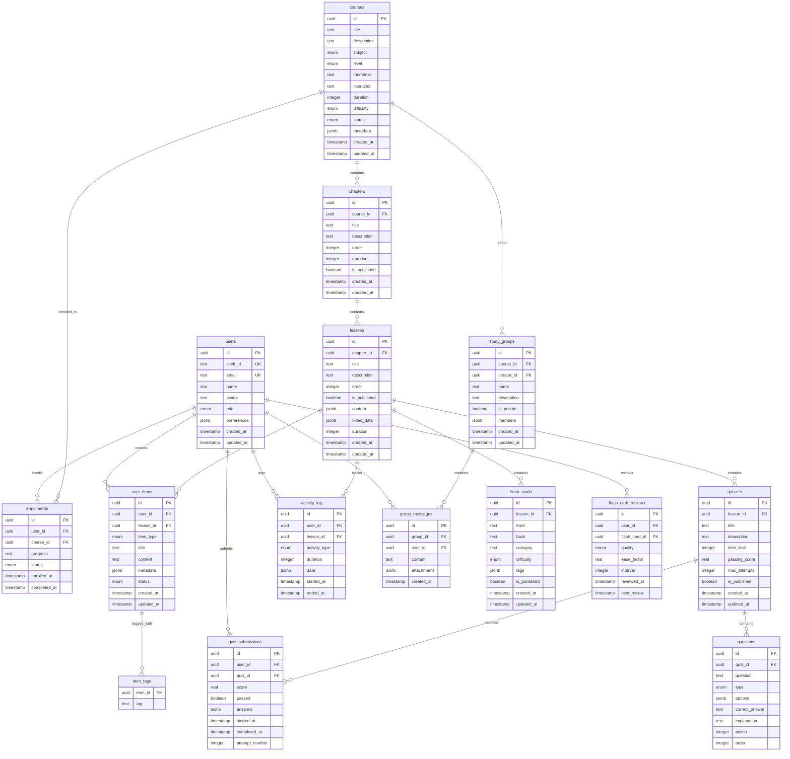

# Streamlined Database Structure for GCSE Pal
## Reduced from 27 tables to 16 tables (40% reduction)

## Consolidation Strategy:

### 1. **Content Tables Merged**
- `lessons` + `lesson_content` + `lesson_video` → single `lessons` table
- Content stored as JSONB fields

### 2. **Study Tracking Unified**
- `study_sessions` + `study_activities` → single `activity_log` table
- Use activity type to distinguish session types

### 3. **User Content Consolidated**
- `notes` + `tasks` + `bookmarks` → single `user_items` table
- Use item_type field to distinguish

### 4. **Assessment System Streamlined**
- `quiz_attempts` + `quiz_answers` → single `quiz_submissions` table
- Answers stored as JSON array

### 5. **Social Features Simplified**
- `study_group_members` merged into `study_groups` as JSON array
- Reduced message table complexity



## Key Consolidations:

### 1. **User Settings → Users.preferences**
```sql
-- Instead of separate user_settings table
ALTER TABLE users ADD COLUMN preferences JSONB;
-- Stores: theme, notifications, study_goals, etc.
```

### 2. **Study Tracking → Activity Log**
```sql
-- Single table for all study activities
activity_log {
  activity_type: enum('session', 'video_watch', 'reading', 'quiz_attempt', 'note_taking')
  data: JSONB with activity-specific details
}
```

### 3. **User Content → User Items**
```sql
-- Single table for notes, tasks, bookmarks
user_items {
  item_type: enum('note', 'task', 'bookmark')
  metadata: JSONB with type-specific fields (due_date, priority, timestamp, etc.)
}
```

### 4. **Content Storage → Lessons**
```sql
-- All lesson content in one place
lessons {
  content: JSONB (markdown content, resources)
  video_data: JSONB (video URLs, mux data, duration)
}
```

### 5. **Study Groups → JSON Members**
```sql
-- Members stored as JSON array
study_groups {
  members: JSONB [
    {user_id: "uuid", role: "owner", joined_at: "timestamp"},
    {user_id: "uuid", role: "member", joined_at: "timestamp"}
  ]
}
```

## Benefits of Consolidation:

### 1. **Reduced Complexity**
- 40% fewer tables (27 → 16)
- Simpler schema to understand and maintain
- Fewer joins required for common queries

### 2. **Better Performance**
- Less join overhead
- JSONB fields allow flexible data storage
- Simplified query patterns

### 3. **Easier Development**
- Fewer models to manage
- Simplified API endpoints
- Reduced boilerplate code

### 4. **Maintained Flexibility**
- JSONB fields allow schema evolution
- Enum fields provide structure
- Still maintain data integrity where needed

## Example JSONB Structures:

### User Items (Notes/Tasks/Bookmarks)
```json
// Note
{
  "content": "Lesson notes here...",
  "tags": ["important", "review"],
  "is_private": true
}

// Task
{
  "description": "Complete homework",
  "due_date": "2024-12-01",
  "priority": "high",
  "tags": ["homework"]
}

// Bookmark
{
  "timestamp": 1250,
  "note": "Important concept here"
}
```

### Activity Log
```json
// Video Watch
{
  "video_url": "https://...",
  "watched_seconds": 300,
  "total_seconds": 600
}

// Study Session
{
  "pages_read": 5,
  "notes_taken": true,
  "focus_score": 8.5
}

// Quiz Attempt
{
  "quiz_id": "uuid",
  "score": 85,
  "questions_answered": 10
}
```

This streamlined approach maintains all functionality while being much more manageable and performant.